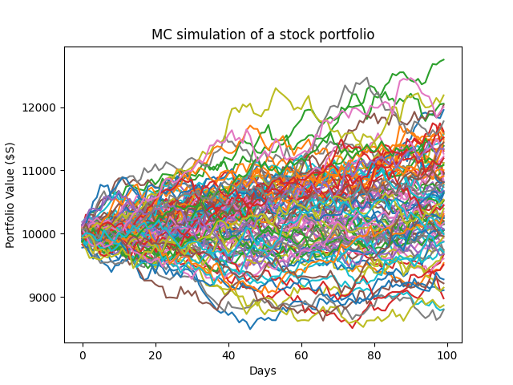

# Monte-Carlo-Simulation-of-a-Stock-Portfolio-in-Python

This project implements a Monte Carlo simulation to model the future value of a stock portfolio over a given timeframe. The simulation is based on historical stock data and generates multiple potential outcomes to assess the risk and return of the portfolio.

## Project Overview
Monte Carlo simulation is a powerful statistical technique used to understand the impact of risk and uncertainty in prediction and forecasting models. In the context of financial portfolios, it helps in modeling the behavior of asset returns and portfolio value under different scenarios.

This Python script performs the following tasks:
<ol>Fetches historical stock data: Using the Yahoo Finance API.</ol>
<ol>Calculates statistical properties: Mean returns and covariance matrix of the selected stocks.</ol>
<ol>Generates random weights: For the stocks in the portfolio.</ol>
<ol>Simulates future portfolio values: Using Monte Carlo simulation.</ol>
<ol>Plots the simulation results: To visualize the range of possible outcomes for the portfolio value.</ol>

## Prerequisites
Ensure you have the following libraries installed:
<ul>pandas</ul>
<ul>numpy</ul>
<ul>matplotlib</ul>
<ul>yfinance</ul>
You can install these libraries using pip install [library]

## Running the MC simulation
Run the Monte Carlo.py script to execute the Monte Carlo simulation. The script fetches data for 5 preselected Australian stocks, computes their mean returns and covariance matrix, and then runs the simulation to predict future portfolio values.

**Fetch Data**:
It defines a get_data function to fetch historical stock data from Yahoo Finance, compute daily returns, mean returns, and the covariance matrix.

**Define Portfolio Weights**:
It generates random weights for the stocks in the portfolio and normalizes them to sum up to 1.

**Monte Carlo Simulation**:
The simulation runs multiple iterations, generating possible future values for the portfolio based on the assumption that daily returns follow a Multivariate Normal Distribution hence Cholesky Decomposition is used to determine the Lower Triangle Matrix.

**Plot Results**:
The script plots the results of the simulation, showing the range of possible outcomes for the portfolio value over time. Choice of time period for this simulation is 100 days.

**Example Output**
The script will output a plot similar to the following:
 

